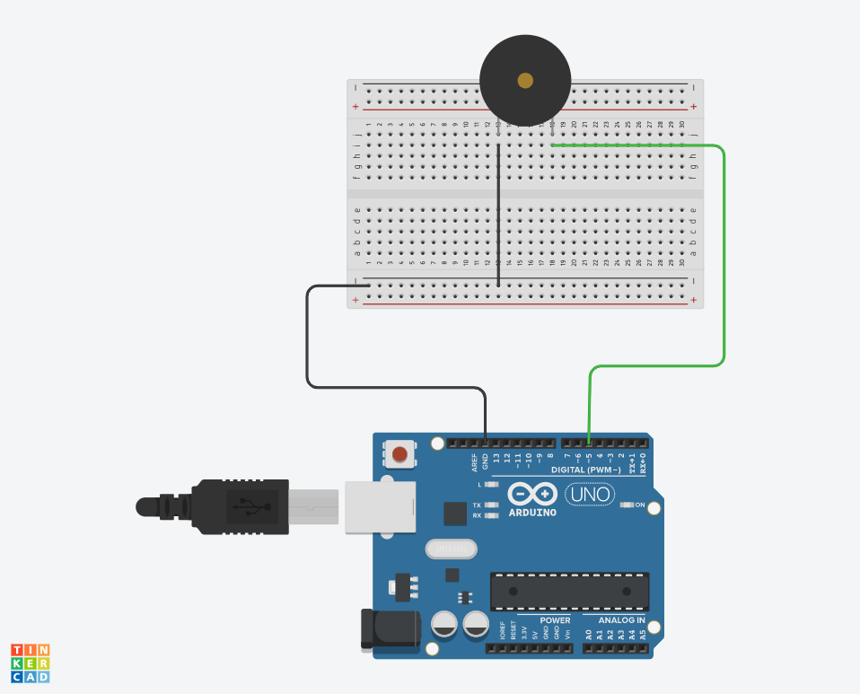

# Buzzer song

This arduino project controlls buzzer and plays the star wars song.

## How it works

The program sends out signals to the buzzer that takes it and make an output sound. In the program there is multiply veriables with diffrent kind of sound (decibel). With those veriables i made a serial of void loops that plays the sound in different order that makes it sound like the star wars theme song. 

## Circuit diagram

## Equipment

- Arduino UNO
- Bread board
- Buzzer
- Electrical cords
- Resistor (should be between the buzzer and the black electrical cord, forgot it in the circuit)

## About me
Isabel Hammarström, a third year student at Tullinge Gymnasium.

isabel.hammarstrom@skola.botkyrka.se